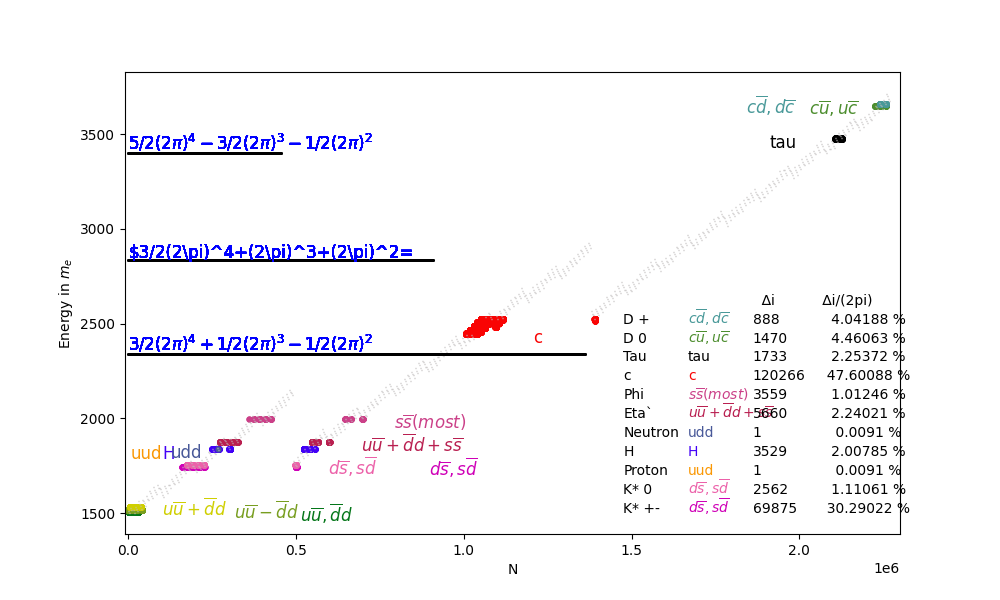

# About this project

An algorithm was developed that describes the rest masses and standard deviations of all elementary particles, taking into account the symmetries for matter/antimatter, attraction/repulsion, and creation and annihilation. It is based on a polynomial P(2π) and three objects, each with three spatial coordinates and a shared time.

## Examplary result (Option 5 – Tau)

More Info can be found here: https://www.physics-beyond-standard-model.com/

# How to setup and run the code on you machine:

## Prerequisites

Before running this project, make sure the following are installed:

### 1. Python
- Python **3.10 or newer**
- Check with:
  python3 --version

If Python is not installed:
- Windows / macOS: https://www.python.org/downloads/
- Linux: install via your package manager

### 2. Make
The project uses a `Makefile` to run simple commands.

Check if `make` is installed:
make --version

If `make` is missing:
- **Linux:** install via your package manager (usually already installed)
- **macOS:** install Xcode Command Line Tools  
  `xcode-select --install`
- **Windows:** use **WSL (Ubuntu)** or **Git Bash** with `make`

### 3. Internet connection (first run only)
Required once to download Python dependencies (`numpy`, `matplotlib`, etc.).

## Installarion and execution

Open a terminal in this folder and run:

1) Create the environment + install:
`make install`

2) Run the program:
`make run`

## Other useful commands
- `make help`   -> list commands
- `make build`  -> build package into dist/
- `make test`   -> run tests (optional)
- `make clean`  -> clean build/test caches

### Windows note
If you are on Windows, use WSL (Ubuntu) or Git Bash with `make` installed.